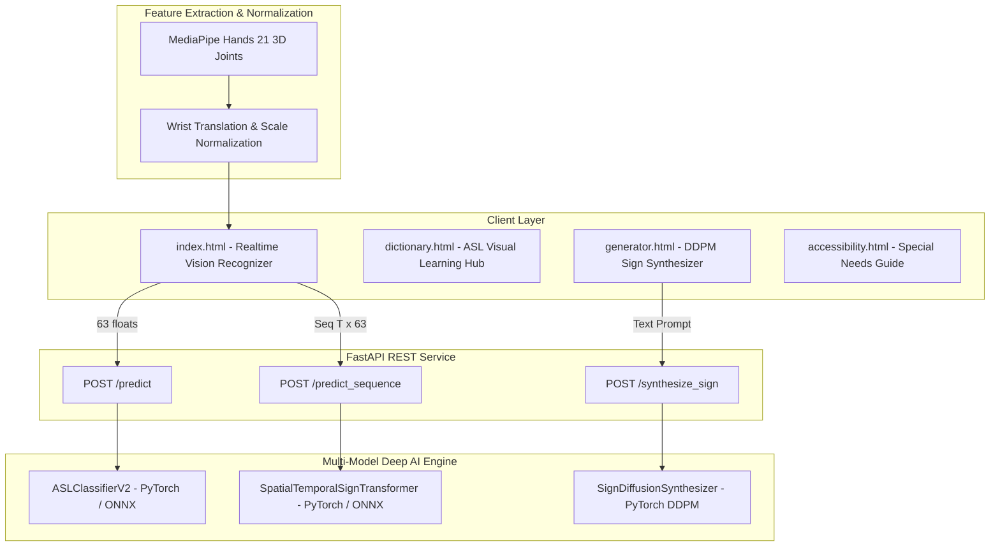

# 🧠 Sign0 Platform — Advanced AI Architecture & Engineering Implementation Guide

A detailed technical specification and mathematical guide for the **Sign0 Multi-Model AI Engine** (MLP Classifier, Spatial-Temporal Transformer, and Denoising Diffusion Synthesizer) and the Multi-Page Accessibility Web Suite.

---

## 🏗️ 1. System Architecture Overview



---

## 📐 2. Mathematical Formulations

### A. Landmark Translation & Scale Normalization
Let $\mathbf{k}_i = (x_i, y_i, z_i) \in \mathbb{R}^3$ for $i = 0, 1, \dots, 20$ represent the 21 raw 3D hand keypoints from MediaPipe, where $\mathbf{k}_0$ is the wrist joint.

1. **Wrist Translation Centering:**
   $$\mathbf{k}_i' = \mathbf{k}_i - \mathbf{k}_0, \quad \text{for } i = 0 \dots 20 \implies \mathbf{k}_0' = (0,0,0)$$

2. **Maximum Euclidean Scale Normalization:**
   $$d_{\max} = \max_{i=0 \dots 20} \|\mathbf{k}_i'\|_2$$
   $$\hat{\mathbf{k}}_i = \frac{\mathbf{k}_i'}{\max(d_{\max}, 10^{-6})}$$
   $$\mathbf{x} = \mathrm{flatten}(\{\hat{\mathbf{k}}_i\}_{i=0}^{20}) \in \mathbb{R}^{63}$$

---

### B. Spatial-Temporal Transformer (`SpatialTemporalSignTransformer`)
For input keypoint trajectory sequence $\mathbf{X} \in \mathbb{R}^{T \times 63}$ across $T$ frames:

1. **Input Projection & Positional Encoding:**
   $$\mathbf{H}_0 = \text{LinearProjection}(\mathbf{X}) + \mathbf{PE} \in \mathbb{R}^{T \times d_{\text{model}}}$$
   where $\mathbf{PE}_{(pos, 2i)} = \sin\left(\frac{pos}{10000^{2i / d_{\text{model}}}}\right)$, $\mathbf{PE}_{(pos, 2i+1)} = \cos\left(\frac{pos}{10000^{2i / d_{\text{model}}}}\right)$.

2. **Multi-Head Self-Attention (MHSA):**
   $$\mathbf{Q} = \mathbf{H}_l \mathbf{W}_Q, \quad \mathbf{K} = \mathbf{H}_l \mathbf{W}_K, \quad \mathbf{V} = \mathbf{H}_l \mathbf{W}_V$$
   $$\text{Attention}(\mathbf{Q}, \mathbf{K}, \mathbf{V}) = \text{softmax}\left(\frac{\mathbf{Q}\mathbf{K}^T}{\sqrt{d_k}}\right) \mathbf{V}$$

3. **Temporal Average Pooling & Classification Head:**
   $$\mathbf{h}_{\text{pooled}} = \frac{1}{T} \sum_{t=1}^T \mathbf{H}_{L, t} \in \mathbb{R}^{d_{\text{model}}}$$
   $$\mathbf{z} = \text{LinearHead}(\mathbf{h}_{\text{pooled}}) \in \mathbb{R}^{26}$$

---

### C. Denoising Diffusion Probabilistic Model (`SignDiffusionSynthesizer`)
Given target 3D landmark sequence $\mathbf{x}_0 \in \mathbb{R}^{T \times 63}$ and text prompt token $c$:

1. **Forward Noise Addition Process $q(\mathbf{x}_t | \mathbf{x}_0)$:**
   $$\mathbf{x}_t = \sqrt{\bar{\alpha}_t} \mathbf{x}_0 + \sqrt{1 - \bar{\alpha}_t} \boldsymbol{\epsilon}, \quad \boldsymbol{\epsilon} \sim \mathcal{N}(\mathbf{0}, \mathbf{I})$$

2. **Denoising Loss Objective:**
   $$\mathcal{L}_{\text{simple}}(\theta) = \mathbb{E}_{t, \mathbf{x}_0, \boldsymbol{\epsilon}} \left[ \|\boldsymbol{\epsilon} - \boldsymbol{\epsilon}_\theta(\mathbf{x}_t, t, c)\|^2 \right]$$

3. **Reverse Sampling Step:**
   $$\mathbf{x}_{t-1} = \frac{1}{\sqrt{\alpha_t}} \left( \mathbf{x}_t - \frac{1 - \alpha_t}{\sqrt{1 - \bar{\alpha}_t}} \boldsymbol{\epsilon}_\theta(\mathbf{x}_t, t, c) \right) + \sigma_t \mathbf{z}$$

---

## 🚀 3. Multi-Page Web Platform Structure

| Page File | Title | Primary Function |
| :--- | :--- | :--- |
| 🏠 `frontend/index.html` | **Real-Time AI Sign Recognizer** | Real-time webcam tracking, MLP/Transformer inference, Word Builder, TTS speech playback. |
| 📚 `frontend/dictionary.html` | **ASL Visual Dictionary & Learning Hub** | Interactive visual grid for alphabets (A-Z), phrases, numbers, search, and TTS audio. |
| 🪄 `frontend/generator.html` | **AI Text-to-Sign Diffusion Synthesizer** | Type custom prompts and view DDPM-synthesized 3D hand skeleton gesture animations. |
| ♿ `frontend/accessibility.html` | **Special Needs Empowerment Guide** | High-contrast dark mode, OpenDyslexic font options, assistive guides for mute & special needs learners. |

---

## 🧪 4. End-to-End Execution & Testing Commands

### Launch FastAPI Backend (Server Port 8000 / 8005)
```powershell
cd backend
python -m uvicorn app:app --reload --host 127.0.0.1 --port 8000
```

### Run Model Verification Suite
```powershell
python test_advanced_backend.py
```

### Open Multi-Page Web Application
```powershell
Start-Process "frontend\index.html"
```
